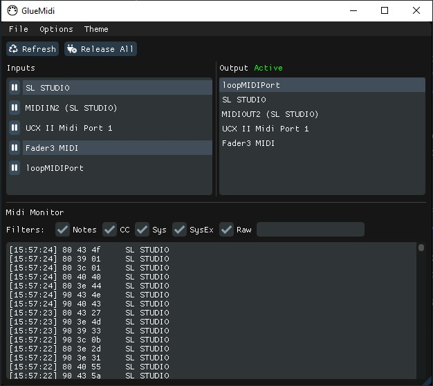

# GlueMidi

## Route MIDI messages from multiple hardware or virtual ports to a single output device or port.

* Hot-plug friendly
* Can live unobtrusively in the system tray
* Icon animates when traffic is being processed
* Handy MIDI monitor 

### About

This app replicates the single thing that I still use MIDI-OX for daily, but with the aim of being a bit less crashy and a lot more amenable to the hotplugging of devices. MIDI-OX remains a Swiss army knife for all things MIDI, and it's very cool that it still works so many years after it was released, and 15 years after it was last updated.

My use-case is that I like my main DAWs of choice (Ableton Live and Reaper) as well as my own custom Unreal Engine audio middleware to have loopMIDI set as their principal MIDI input. loopMIDI is a great multi-client virtual MIDI device. Most devices/drivers are not multi-client, so feeding other devices through a single loopMIDI port lets me get e.g. my master MIDI keyboard, my Lightpad MPE thingy and my Fader3 USB controller all sending data to the same endpoint and accessible wherever I need it.

I wrote it for myself, and it works for me in my everyday workflow, but feel free to post bugs if you find them - bearing in mind that I'll probably not have time to deal with anything major. 

It's Windows-only because a) other operating systems are well served for this kind of functionality and b) it uses a hell of a lot of Win32 API weirdness that I'm not interested in making portable.

As usual, go nuts with it but don't blame me if it doesn't work or breaks something else somehow. 

### Features
* Can optionally start minimised to tray
* Can optionally minimise to tray when the window is closed, otherwise it quits
* Saves input and output ports on quit; connects them on load (if found)
* Can refresh to check for new ports/devices, or release all ports/devices for other apps to use 
* Each input can be 'paused' to temporarily prevent its messages from going to the output
* The Midi Monitor shows incoming messages and can be filtered by message type or device name/s (partial or whole non-case-sensitive match)
* Tray icon is animated to signal incoming MIDI activity from active ports/devices.

### TO DO 
* Not all of the message type filters are working yet and I'd like to tidy up some of the Midi Monitor formatting a bit
* The .ini structure could be improved for saving/loading arrays but it basically works right now and I can't remember what the problem was. It'll come to me...